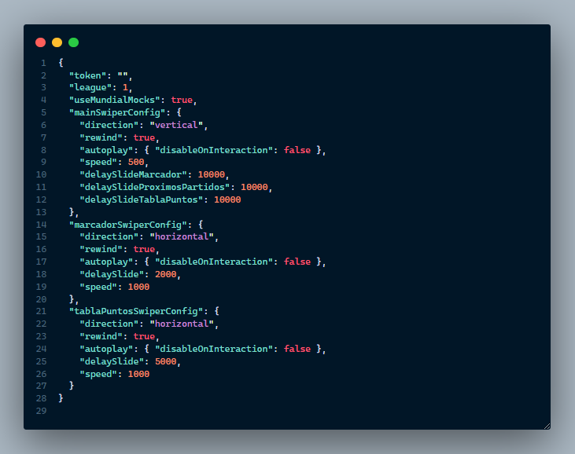

# Documentación/Configuración del proyecto

## Aspectos técnicos

El proyecto fue realizado utilizando el framework [Angular](https://angular.io/), versión 12 del cli.
Las librerías utilizadas fueron [swiper js](https://swiperjs.com/angular), [ng-particles, tsparticles.](https://www.npmjs.com/package/ng-particles) Para dar efectos y funcionalidad al sitio.

### Configuración

Dentro del build del proyecto compartido, se encontrarán con la carpeta de **"assets"** , que hace referencia a la carpeta de recursos del sitio.

- **Configuración de imagen de logo:**

Dentro de la misma encontrarán la carpeta logos, donde verán la

**imagen de logo** que utilizara el sitio web para mostrar en las diferentes pantallas. Este mismo **puede ser reemplazado** , siempre en cuando la imagen a utilizar tenga el **mismo nombre** y sea de **extensión "PNG".**

- **Configuración de token/pantallas:**

Dentro de assets se encontrarán con un archivo de nombre **"config.json"** en el mismo tendrán **acceso a editar** el " **token"** que se utiliza para el consumo de API. Y además, podrán cambiar la configuración de tiempo y velocidad en el que se produce el swiper de las diferentes pantallas.

### Archivo de configuración

" **token"** : token para uso de la API.

" **mainSwiperConfig"** : es quien maneja el comportamiento de las 3 pantallas, dentro se encuentran los datos **"delaySlideMarcador"** , **"delaySlideProximosPartidos"** , **"delaySlideTablaPuntos"** con su valor asignado de tiempo en el que se produce el swipe de esa pantalla expresado en **milisegundos**.

" **marcadorSwiperConfig" y "tablaPuntosSwiperConfig"** : son quienes manejan el comportamiento de la pantalla de marcador de un partido y la tabla de puntos respectivamente. En ellos se pueden actualizar el valor de **"delaySlide"** y **"speed"** , que hacen referencia al tiempo en el que se produce el slide y la velocidad de la transición.

Los demás datos se recomienda no actualizarlos para el correcto funcionamiento del sitio.
